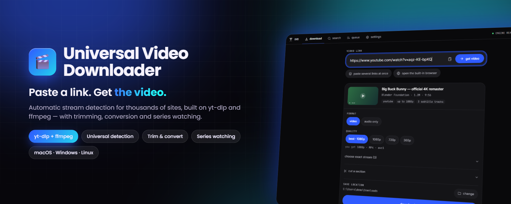

<div align="center">



# Universal Video Downloader

**Paste a link. Get the video — from thousands of sites, including the ones nobody wrote code for.**

[](https://github.com/DenisHumen/Universal-Video-Downloader-/releases/latest)
[](https://github.com/DenisHumen/Universal-Video-Downloader-/actions/workflows/ci.yml)
[](#-quick-start)
[](https://www.electronjs.org/)
[](https://www.typescriptlang.org/)
[](LICENSE)
[](https://github.com/DenisHumen/Universal-Video-Downloader-/commits/main)

**English** · [Русский](README.ru.md)

[**⬇ Download**](https://github.com/DenisHumen/Universal-Video-Downloader-/releases/latest) &nbsp;·&nbsp; [Features](#-features) &nbsp;·&nbsp; [Screenshots](#-screenshots) &nbsp;·&nbsp; [Quick start](#-quick-start) &nbsp;·&nbsp; [A site doesn't work?](#-a-site-doesnt-work)

</div>

---

Universal Video Downloader is a free desktop app for macOS, Windows and Linux that finds the video stream on almost any web page and downloads it. It is built on [yt-dlp](https://github.com/yt-dlp/yt-dlp) and ffmpeg, adds automatic stream detection for sites yt-dlp does not know, and wraps it all in an interface that tells you the truth about what it is doing — which quality you will actually get, how big the file is, and which step is running. English / Русский interface, no account, no telemetry.

<div align="center">
  
</div>

## ✨ Features

| | |
|---|---|
| 🔎 **Universal detection** | yt-dlp's 1800+ sites first, then a static scrape of the page, then a hidden Chromium pass that captures the manifest *off the wire* together with the headers the CDN demands. |
| 🎯 **Honest quality** | The quality row is built from the heights the video really offers, and “best” says what it resolved to: `2160p60 · HDR · MP4 · avc1 · ≈ 1.2 GB`. |
| 📊 **Honest progress** | One bar across download (0–90 %) and post-processing (the last tenth, with the step named). Speed, ETA per row and for the whole queue, pause / resume / retry / cancel. |
| ✂️ **Trim & convert** | Cut a section *before* downloading (only that part is fetched), re-cut finished files, convert to MP4 / MKV / WebM / MOV / GIF or extract MP3 / M4A / OPUS / FLAC / WAV / AAC. |
| 🔍 **Search by title** | YouTube, SoundCloud, Dailymotion, Bilibili, Niconico, PornHub and the YummyAnime catalogue — one service or all at once. |
| 🌐 **Built-in browser** | When detection comes up empty: browse to the video, play it, and every media request appears in a side panel. **Pick mode** grabs a player's source by clicking it. |
| 🎞 **Streaming sites** | Hand-written resolvers for HDrezka, YummyAnime (Kodik player) and CumGloryHole: voiceovers, seasons, episodes and qualities, with multi-select. |
| 👁 **Watch a series** | Keep an eye on a series and handle every new episode automatically: download → rename → upload to an SMB share → notify in Telegram. |
| 📚 **Playlists & batches** | Playlists, channels and sets expand into a pickable list; paste a whole list of URLs at once. |
| 🧩 **Post-processing** | Embed thumbnails, metadata, chapters and subtitles, write `.srt` files, SponsorBlock, per-site subfolders, filename template, speed limit. |
| 🍪 **Restricted sites** | Age-gated, login-only and members-only videos via cookies from your browser or a `cookies.txt` file. |
| 🌍 **English & Русский** | Full interface including menus, tray and notifications; engine errors are translated too, with the original kept for bug reports. |
| 🔄 **Self-updating** | The app updates itself from GitHub Releases; the yt-dlp engine refreshes once a day, never during a download. |
| 🔒 **Private & local** | Everything runs on your machine. No accounts, no telemetry. |

## 📸 Screenshots

<table>
  <tr>
    <td width="50%"><p align="center"><b>Home</b> — paste a link, pick what you get</p></td>
    <td width="50%"><p align="center"><b>Queue</b> — one bar for download and post-processing</p></td>
  </tr>
  <tr>
    <td><p align="center"><b>Search</b> — by title, across services</p></td>
    <td><p align="center"><b>Settings</b></p></td>
  </tr>
  <tr>
    <td colspan="2"><p align="center"><b>Day theme</b> — designed on its own, not an inverted copy of the night one</p></td>
  </tr>
</table>

## 🚀 Quick start

### Download

| Platform | Download | File |
| --- | --- | --- |
| **Windows 10/11** | [**Latest release ↓**](https://github.com/DenisHumen/Universal-Video-Downloader-/releases/latest) | `…-windows-x64-setup.exe` |
| **macOS** (Apple Silicon) | [**Latest release ↓**](https://github.com/DenisHumen/Universal-Video-Downloader-/releases/latest) | `…-mac-arm64.dmg` |
| **macOS** (Intel) | [**Latest release ↓**](https://github.com/DenisHumen/Universal-Video-Downloader-/releases/latest) | `…-mac-x64.dmg` |
| **Ubuntu / Debian** | [**Latest release ↓**](https://github.com/DenisHumen/Universal-Video-Downloader-/releases/latest) | `.deb` or `.AppImage` |
| **Fedora / RHEL** | [**Latest release ↓**](https://github.com/DenisHumen/Universal-Video-Downloader-/releases/latest) | `.rpm` or `.AppImage` |

1. Install and launch the app. On first run it fetches the yt-dlp engine binary (~30 MB) by itself and keeps it up to date after that. ffmpeg is bundled.
2. Paste a link on the **download** tab (or drop it anywhere in the window).
3. Pick the quality and format — the app shows what you will actually get — and press download. Files go to your system *Downloads* folder by default.

### macOS: “the app is damaged and can’t be opened”

**It isn’t.** These builds are unsigned — there is no €99/year Apple Developer certificate behind them — and on recent macOS, Gatekeeper reports *any* quarantined unsigned app with that sentence. It sounds like a corrupt download, so people re-download it and see it again.

Copy the app into **Applications**, then run this once:

```bash
xattr -dr com.apple.quarantine "/Applications/Universal Video Downloader.app"
```

The command is printed on the install window itself, so you don't have to come back here for it. (Or: right-click the app in Applications → **Open** → **Open**.) Because they're unsigned, macOS builds also can't install updates in place — the app offers you the download page instead of pretending it can restart into a new version. The same manual path is used for `.deb` / `.rpm` installs.

## 🧭 Usage

### Universal detection — no per-site work required

Most downloaders only handle sites someone wrote code for. This one tries three strategies in order, cheapest first, and stops at the first that works:

1. **The engine** — yt-dlp knows 1800+ sites natively, including YouTube (and Shorts), TikTok, Instagram Reels, X/Twitter, Reddit, Twitch, VK, Vimeo, Dailymotion, SoundCloud, Bilibili and Niconico. Share links are canonicalised first, so a `youtu.be/…?si=…`, a `/shorts/…` and a TikTok link carrying six analytics parameters all resolve to the same video — and only queue once.
2. **A static scrape** — if the engine doesn't know the site, the app reads the page itself: JSON-LD `VideoObject`, OpenGraph `og:video`, `<video>`/`<source>` tags, JW Player / Video.js / Plyr configs, and one level of player iframes.
3. **A headless browser pass** — still nothing? The app opens the page in a hidden Chromium window, starts the player (reaching into shadow DOM and lazy `data-*` sources, which is where modern players hide), and captures the manifest request *off the wire* — together with the exact `Referer` / `Origin` / `Cookie` headers the CDN demands. Those headers are handed to the download engine, so the stream downloads the same way the browser would have played it.

Candidates are scored (HLS manifest ≫ DASH ≫ progressive MP4 ≫ audio; trailers, sprite strips, ad-network media and individual HLS segments are demoted) and recognised **by response type as well as by filename**, which is what makes extensionless CDN manifests work. When a manifest turns up, the app keeps listening for a moment longer rather than grabbing the first one it sees — the master playlist and the 480p variant the player happened to pick are both manifests, and only one of them has the 4K in it.

Stream links expire, so the queue stores the *page* URL and re-runs detection on every start and retry. The headless pass can be switched off in **Settings → detection**.

### It tells you what “best” means

A preset is a promise about a number, and “best” used to be the one keeping it a secret. The quality row is built from the heights the video really offers — no phantom 360p button on a 720/480/240 video — and the automatic choice says which one it resolved to, with the container and the size you're about to spend:

> **quality** — `best · 4K` `1080p` `720p` `360p`
> *you get* `2160p60 · HDR · MP4 · avc1 · ≈ 1.2 GB`

The queue keeps saying it, so a row downloading at “best” still tells you whether that turned out to be 1080p or 360p.

### An honest progress bar

Fetching the bytes is not the whole job. A trimmed download re-encodes the cut, a video+audio download merges two streams, an audio download extracts and converts — and on a long video that half can take as long as the first. So the bar is split: the download owns 0–90 %, post-processing owns the last tenth and names the step it is running.

Trimmed and live downloads are handed to ffmpeg by the engine, which reports none of yt-dlp's own progress lines — the app reads ffmpeg's own output instead, so “cut a section and download it” shows a bar that moves rather than one that sits at zero and then jumps to done. When a site reports no size at all, the bar says so with motion instead of a confident 0 % that never changes.

Speed, ETA per row and for the whole queue, pause / resume / retry / cancel at any stage, automatic retries for transient network failures, and the engine's raw output one click away when something goes wrong. While downloads are running the app keeps the computer from going to sleep (the screen may still turn off), and interrupted downloads are picked back up on the next launch.

### Trim and convert, without leaving the app

- **Cut before you download.** Set a start and end on the video's timeline and the engine fetches *only that section* — clipping 30 seconds out of a two-hour stream costs 30 seconds of bandwidth, not the whole file.
- **Trim what you already have.** Any finished download can be re-cut.
- **Exact or fast, either way.** The default is a frame-accurate cut — re-encoded, so “remove the intro” actually removes the intro. A stream copy is one click away when speed matters more: near-instant, at the price of landing on the nearest keyframe. The choice applies to a trimmed *download* as well as to a file already on disk, and on a long clip it is the difference between seconds and minutes.
- **Convert** to MP4, MKV, WebM, MOV or an animated GIF, extract audio as MP3, M4A, OPUS, FLAC, WAV or AAC, and downscale on the way. Conversions run in the same queue as downloads.

### Search by title

Type a title instead of a link. Search **all services at once** or pick one: YouTube, SoundCloud, Dailymotion, Bilibili, Niconico, PornHub and the YummyAnime catalogue. Results carry thumbnails, durations and a best-available-quality badge.

### Built-in browser, for when nothing is found

Automatic detection is good, not omniscient. When it comes up empty, the app opens a real Chromium view: browse to the video, play it, and every media request the page makes appears in a side panel, one click from the queue. **Pick mode** highlights elements as you hover — click the player and the app takes that element's source.

It shares its session with the headless detector, so a consent banner you dismiss or a login you complete here still applies when a queued item is re-resolved later.

### Hand-written resolvers, for the sites that need them

Some players hide their stream behind a signed AJAX call that no generic scraper can reach. Those get a small dedicated module in `src/main/resolvers/sites/` — currently **HDrezka** (and its mirror domains), **YummyAnime** (via the Kodik player) and **CumGloryHole**.

For streaming sites the app reads the available **voiceovers (озвучки)**, **seasons**, **episodes** and **qualities**, lets you multi-select episodes, and queues each as `Title - S01E02`. Premium-only translations are flagged and can't be downloaded.

### Watch a series — new episodes, handled automatically

The **watch** tab keeps an eye on series pages. Paste a link to a series (the page that lists its episodes), choose the translation — dubs carry different numbers of episodes, so this decides what counts as new — and how often to check. Every episode that appears later runs that watch's pipeline:

| Step | What it does |
| --- | --- |
| **download** | Always first. Drives the normal download queue, so pause, cancel, retry and history work as usual. |
| **rename** | A filename template with `{title}` `{season}` `{episode}` `{season2}` `{episode2}` `{quality}` `{year}`, plus find/replace rules for the title (the site answers in its own language; this is how the file gets your name for it). |
| **send to a share** | Uploads to an SMB share (server, share, username, password), creating missing folders; the same tokens work in the remote path. Can delete the local copy afterwards. |
| **notify in Telegram** | A message from your own bot when an episode arrives, and when one fails. |

- Watching works with series from the built-in streaming resolvers and has been verified against **YummyAnime**. A title that has been announced but is not out yet can be watched too: its release date is re-checked once a day, and once episodes appear the fullest translation is picked.
- Checks run on a schedule with jitter and back-off on failures (the minimum interval is 15 minutes); **check now** runs one immediately.
- **Settings → watching** turns on *keep watching in the background* (closing the window keeps schedules running, via the tray) and *start with the system* (packaged builds only).
- The SMB password and the Telegram bot token are encrypted by your operating system's key store and never written to a settings file.

The design notes behind this feature live in [`docs/automation.md`](docs/automation.md).

### Everything else

- **Playlists & channels** — a playlist, channel or set link expands into a pickable list with per-item checkboxes, “select all”, a range picker, and bulk download. A link to one video that merely *sits inside* a playlist still downloads that one video.
- **Batch links** — paste a whole list of URLs and queue them in one go.
- **Post-processing** — embed thumbnails, metadata, chapters and subtitles; write subtitles as separate `.srt` files; SponsorBlock segment removal; per-site subfolders; a speed limit.
- **Restricted sites** — age-verification, login-only and members-only videos work by reading cookies from your browser, or from a `cookies.txt` file: **Settings → access & cookies**. When a failure looks like an access gate, the app says so and offers the setting.
- **Errors in your language** — the engine only speaks English; the app translates what it says, and keeps the original underneath for a bug report.
- **Themes & language** — two designed themes, night and day, and a full **English / Русский** interface — menus, tray and notifications included — that follows your system locale by default.
- **Convenience** — desktop notifications, taskbar/dock progress, an optional tray icon that keeps downloads running when the window is closed, an optional clipboard watcher, drag-and-drop, paste-anywhere, a native menu bar and keyboard shortcuts (⌘/Ctrl+1…5 switch tabs, ⌘/Ctrl+, opens settings, ⌘/Ctrl+/ shows all shortcuts).
- **Self-updating** — checks for new releases on launch and installs them. The yt-dlp engine keeps itself up to date too — once a day, and never while a download is running.
- **Private & local** — everything runs on your machine. No accounts, no telemetry.

## ⚙️ Configuration

Everything is configured in the app (**settings** tab, or ⌘/Ctrl+,). The sections and what they hold:

| Section | Settings |
| --- | --- |
| **appearance** | Theme (night / day), language (follows the system by default) |
| **downloads** | Download folder (default: system *Downloads*), per-site subfolders, default mode, default quality, audio format, parallel downloads (default 3), resume on launch, speed limit (e.g. `2M`, `500K`), how many playlist/channel entries to list (default 500) |
| **post-processing** | Embed thumbnail / metadata / chapters / subtitles, write `.srt`, subtitle languages (default `en,ru`), SponsorBlock, prefer H.264 + AAC when the site offers a choice, restrict filenames, filename template (default `%(title)s [%(id)s].%(ext)s`) |
| **detection** | Universal detection — the hidden-browser pass for sites without a resolver (on by default) |
| **watching** | Keep watching in the background, start with the system, SMB shares, Telegram notifications, detailed log, a button that reveals the log file |
| **access & cookies** | Read cookies from Chrome, Firefox, Edge, Safari, Brave, Chromium, Opera or Vivaldi, or from a Netscape-format `cookies.txt` (takes precedence) |
| **network** | Proxy (`http://host:port`) — used by the engine *and* by the app's own requests (pages, site APIs, the built-in browser, the update check) |
| **system** | Desktop notifications, clipboard watcher, tray icon |
| **updates** | Automatic updates |
| **about** | About the app, a link to GitHub, reset all settings |

The app keeps its state in the OS's per-user application data folder: `settings.json`, the download history and `watches.json`. The log (`uvd.log`, rotated at 2 MB × 5 files) lives in the app's logs folder; secrets and signed URLs are redacted before anything is written.

## 🤔 A site doesn't work?

In rough order of how often it helps:

1. **Turn on cookies.** *Settings → access & cookies* → pick the browser you're signed into. Age gates, login walls and "members only" all disappear. Close that browser while downloading — it locks its own cookie database.
2. **Use the built-in browser.** *open the built-in browser*, go to the video, press play. Every stream the page requests shows up in the side panel, one click from the queue — and whatever you did to get there (a consent banner, a login) is remembered for later re-downloads.
3. **Check universal detection is on.** *Settings → detection*. Without it the app can only download from sites the engine already knows.
4. **Give it a minute.** An unknown site takes up to half a minute: the app is loading the page in a hidden window and waiting for its player to ask for the video.
5. **Still nothing?** [Open an issue](https://github.com/DenisHumen/Universal-Video-Downloader-/issues/new) with the link and the engine output from the queue row's *engine output* drawer. Most sites need no code at all; the ones that do get a small module in `src/main/resolvers/sites/`.

## 🧱 Tech stack

| Layer | Choice |
| --- | --- |
| Shell | Electron 33 |
| Build | electron-vite + electron-builder |
| UI | React 18 + TypeScript + Tailwind CSS |
| Animation | Framer Motion |
| State | Zustand |
| Tests | Vitest |
| Engine | yt-dlp (managed at runtime) + ffmpeg (bundled; release builds pin ffmpeg 9.0.2) |
| SMB uploads | node-smb2 |
| Updates | electron-updater (GitHub provider) |

### 🎨 The look

**UVD — Precision**, a Swiss-modernist system: a strict grid, hairline rules instead of shadows, near-monochrome planes, and exactly one saturated colour. Depth comes from stacking flat surfaces, never from blur or glow. Navigation is a text tab strip on a single 48px bar — no sidebar anywhere. Interface type is Inter; every measurement, path and identifier is set in JetBrains Mono with tabular figures, so data is always distinguishable from labels at a glance. Both faces ship with the app rather than being fetched, so it looks identical offline. One easing curve — `cubic-bezier(0.2, 0, 0, 1)` — and three durations cover every transition, and nothing animates while idle.

Two themes, one accent, and the light one is not a tint-inverted copy of the dark one — a light interface needs a canvas *darker* than the planes on it, or every block dissolves into the page.

Text colours are named tokens rather than alphas over a foreground, because the same alpha reads very differently on every surface it lands on — which is how a palette silently drifts under AA. `npm run check:contrast` parses the real values out of the stylesheet and checks every text/plane pairing across both themes, failing CI below WCAG AA (4.5:1).

The full specification lives in [`design-system/universal-video-downloader/MASTER.md`](design-system/universal-video-downloader/MASTER.md).

### 🛠 Development

Requires Node.js (CI uses Node 20) and npm.

```bash
npm install              # install dependencies
npm run dev              # launch the app with hot reload
npm run typecheck        # type-check main + renderer
npm test                 # unit tests
npm run check:contrast   # WCAG AA gate over every theme
npm run build            # bundle main, preload and renderer
```

A few extras worth knowing about:

```bash
npm run preview          # the renderer alone, in a browser, against a mock IPC bridge
npm run shots            # regenerate docs/screenshots (--theme=day|both for light)
npm run make:icons       # rasterise the logo into app, tray and DMG artwork
npm run fetch:ffmpeg     # replace ffmpeg-static's binary with the pinned ffmpeg 9.0.2 (as CI does)
npm run check:ffmpeg     # verify the bundled ffmpeg matches the target architecture
```

`npm run preview` is how the UI gets worked on without booting Electron: `src/renderer/src/lib/mockApi.ts` stands in for the preload bridge, including states the real app only reaches occasionally (the first-run engine download, the update banner, every queue row state).

Build distributables locally:

```bash
npm run pack         # unpacked app in release/<version>/ (quick packaging check)
npm run dist:mac     # .dmg + .zip
npm run dist:win     # .exe (NSIS)
npm run dist:linux   # .AppImage + .deb + .rpm
```

### 📦 Releasing

Pushing a `v*` tag triggers the [release workflow](.github/workflows/release.yml), which first checks that the tag matches `package.json`, then builds on macOS (arm64 and x64), Windows and Linux runners and publishes artifacts to GitHub Releases — including the `latest*.yml` metadata that powers in-app auto-updates.

```bash
npm version patch        # bump version + create tag
git push --follow-tags   # CI builds & publishes the release
```

## 📁 Project structure

```
src/
├── main/                      # Electron main process
│   ├── index.ts               # windows, menu, tray, lifecycle
│   ├── ipc.ts                 # IPC handlers ↔ renderer
│   ├── automation-ipc.ts      # IPC for watches, shares and Telegram
│   ├── resolvers/             # turning a link into a downloadable stream
│   │   ├── index.ts           # registry + internal uvd-*:// schemes
│   │   ├── http.ts            # shared fetch/parse helpers
│   │   ├── upcoming.ts        # titles announced but not out yet
│   │   ├── sites/             # one module per hand-written site
│   │   └── universal/         # site-agnostic detection
│   │       ├── static.ts      #   HTML/JSON-LD/OpenGraph/player configs
│   │       ├── sniffer.ts     #   hidden browser + network capture
│   │       ├── candidates.ts  #   scoring & ranking of media URLs
│   │       ├── capture.ts     #   shared, ref-counted webRequest hooks
│   │       └── direct.ts      #   uvd-direct:// — a stream picked by hand
│   └── services/
│       ├── ytdlp.ts           # downloads & manages the yt-dlp binary
│       ├── detector.ts        # the engine → scrape → browser cascade
│       ├── downloader.ts      # queue: downloads, trims and conversions
│       ├── progress.ts        # one bar across download + post-processing
│       ├── throttle.ts        # how often a running job is allowed to speak
│       ├── schedule.ts        # what the queue starts next
│       ├── dedupe.ts          # refusing a second entry for the same file
│       ├── resume.ts          # which downloads a restart should pick back up
│       ├── ffmpeg.ts          # bundled ffmpeg: trim, convert, probe
│       ├── ffmpeg-output.ts   # reading ffmpeg's console chatter for progress
│       ├── browser.ts         # the built-in browser window
│       ├── search.ts          # title search across services
│       ├── clipboard.ts       # the optional clipboard watcher
│       ├── awake.ts           # keeps the machine awake while downloading
│       ├── proxy.ts           # applies the proxy to the app's own requests
│       ├── updater.ts         # auto-update (+ manual fallback)
│       ├── locale.ts          # the strings the OS draws, not React
│       ├── log.ts             # rotating, redacting log file
│       ├── secrets.ts         # OS-encrypted storage for passwords and tokens
│       ├── options.ts         # engine flags & error classification
│       ├── settings.ts        # persisted user settings
│       └── automation/        # watches: detect, schedule, pipeline, SMB, Telegram
├── preload/
│   ├── index.ts               # secure contextBridge API
│   └── site.ts                # injected into pages in the built-in browser
├── renderer/                  # React UI
│   └── src/
│       ├── components/        # top bar, cards, rows, banners…
│       ├── views/             # Home, Search, Downloads, Automation, Settings
│       ├── lib/               # quality resolution, errors, formatting, motion
│       ├── i18n/              # en + ru dictionaries
│       └── store.ts           # Zustand store wired to IPC events
└── shared/                    # types, IPC channel names, URL canonicalisation, automation model
```

Other top-level folders: `scripts/` (ffmpeg, icons, screenshots, contrast and packaging helpers), `design-system/` (the visual spec), `docs/` (screenshots and design notes), `build/` and `resources/` (packaging artwork and icons).

### Adding a site by hand

1. Create `src/main/resolvers/sites/<site>.ts` exporting a `SiteResolver[]`.
2. Add it to the `resolvers` array in `src/main/resolvers/index.ts`.

A resolver returns the real stream URL plus any headers it needs — or a list of entries, or a full episode/quality picker. Everything downstream (queue, retries, re-resolution) already handles all three shapes.

## 🤝 Contributing

The app is actively developed. Bug reports, site requests and pull requests are welcome — [open an issue](https://github.com/DenisHumen/Universal-Video-Downloader-/issues) (include the link and the *engine output* for a failing site), or ask for a new service on [Telegram](https://t.me/DenisHumen). Before a PR, run `npm run typecheck`, `npm test` and `npm run check:contrast` — CI runs the same checks.

## ⚖️ Legal

This tool is for downloading content you have the right to access. Respect the terms of service and copyright of the sites you use it with.

## 📄 License

[MIT](LICENSE) © Denis Humen
