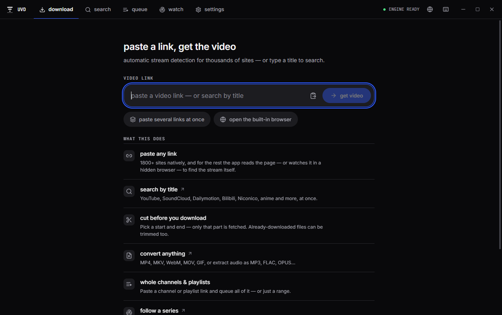
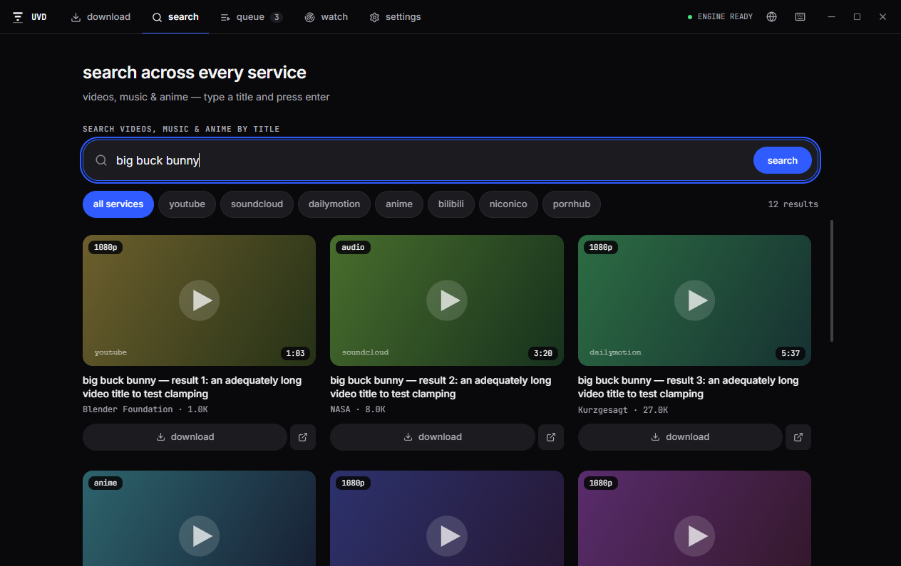
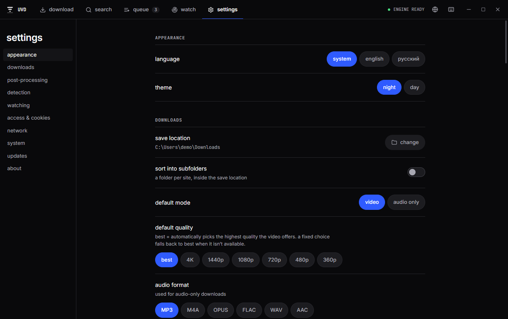

<div align="center">


# Universal Video Downloader

**Paste a link. Get the video.**

Automatic stream detection for thousands of sites — including the ones nobody wrote code for.
Built on [yt-dlp](https://github.com/yt-dlp/yt-dlp) and ffmpeg, wrapped in an interface that tells you the truth about what it is doing.

[](https://github.com/DenisHumen/Universal-Video-Downloader-/releases/latest)
[](https://github.com/DenisHumen/Universal-Video-Downloader-/actions/workflows/ci.yml)
[](LICENSE)

macOS · Windows · Linux &nbsp;·&nbsp; English / Русский &nbsp;·&nbsp; no account, no telemetry


</div>

---

## 📦 Get it

| | Download | File |
| --- | --- | --- |
| **Windows 10/11** | [**Latest release ↓**](https://github.com/DenisHumen/Universal-Video-Downloader-/releases/latest) | `…-windows-x64-setup.exe` |
| **macOS** (Apple Silicon) | [**Latest release ↓**](https://github.com/DenisHumen/Universal-Video-Downloader-/releases/latest) | `…-mac-arm64.dmg` |
| **macOS** (Intel) | [**Latest release ↓**](https://github.com/DenisHumen/Universal-Video-Downloader-/releases/latest) | `…-mac-x64.dmg` |
| **Ubuntu / Debian / Mint** | [**Latest release ↓**](https://github.com/DenisHumen/Universal-Video-Downloader-/releases/latest) | `…-linux-amd64.deb` |
| **Fedora / RHEL / openSUSE** | [**Latest release ↓**](https://github.com/DenisHumen/Universal-Video-Downloader-/releases/latest) | `…-linux-x86_64.rpm` |
| **Other Linux** | [**Latest release ↓**](https://github.com/DenisHumen/Universal-Video-Downloader-/releases/latest) | `…-linux-x86_64.AppImage` |

On first run the app fetches the yt-dlp engine binary (~30 MB) by itself, and keeps it up to date after that. ffmpeg is bundled.

### macOS: “the app is damaged and can’t be opened”

**It isn’t.** There is no €99/year Apple Developer certificate behind these builds, so macOS
quarantines them, and on recent macOS Gatekeeper reports a quarantined app without one with that
sentence. It sounds like a corrupt download, so people re-download it and see it again.

Copy the app into **Applications**, then run this once:

```bash
xattr -dr com.apple.quarantine "/Applications/Universal Video Downloader.app"
```

The command is printed on the install window itself, so you don't have to come back here for it.
Without that certificate, macOS builds also can't install updates in place — the app offers you
the download page instead of pretending it can restart into a new version.

### Ubuntu 24.04 and newer: take the `.deb`

Since 24.04, Ubuntu (and Mint, Pop!_OS and Zorin, which are built on it) lets an app use the
sandbox Chromium relies on only if an AppArmor profile allows it. The `.deb` installs that profile,
so it just works. The AppImage can't install one, so there it closes as soon as it starts. The
usual workaround, starting it with `--no-sandbox`, switches off the wall between the websites the
app opens and your system, which is why we don't recommend it.

---

## ✨ What it does

### Universal detection — no per-site work required

Most downloaders only handle sites someone wrote code for. This one tries three strategies in
order, cheapest first, and stops at the first that works:

1. **The engine** — yt-dlp knows 1800+ sites natively, including YouTube (and Shorts), TikTok,
   Instagram Reels, X/Twitter, Reddit, Twitch, VK, Vimeo, Dailymotion, SoundCloud, Bilibili and
   Niconico. Share links are canonicalised first, so a `youtu.be/…?si=…`, a `/shorts/…` and a
   TikTok link carrying six analytics parameters all resolve to the same video — and only queue
   once.
2. **A static scrape** — if the engine doesn't know the site, the app reads the page itself:
   JSON-LD `VideoObject`, OpenGraph `og:video`, `<video>`/`<source>` tags, JW Player / Video.js /
   Plyr configs, and one level of player iframes.
3. **A headless browser pass** — still nothing? The app opens the page in a hidden Chromium
   window, starts the player (reaching into shadow DOM and lazy `data-*` sources, which is where
   modern players hide), and captures the manifest request *off the wire* — together with the
   exact `Referer` / `Origin` / `Cookie` headers the CDN demands. Those headers are handed to the
   download engine, so the stream downloads the same way the browser would have played it.

Candidates are scored (HLS manifest ≫ DASH ≫ progressive MP4 ≫ audio; trailers, sprite strips,
ad-network media and individual HLS segments are demoted) and recognised **by response type as
well as by filename**, which is what makes extensionless CDN manifests work. When a manifest turns
up, the app keeps listening for a moment longer rather than grabbing the first one it sees — the
master playlist and the 480p variant the player happened to pick are both manifests, and only one
of them has the 4K in it.

Stream links expire, so the queue stores the *page* URL and re-runs detection on every start and retry.
The headless pass can be switched off in **Settings → detection**.

### It tells you what “best” means



A preset is a promise about a number, and “best” used to be the one keeping it a secret. The
quality row is built from the heights the video really offers — no phantom 360p button on a
720/480/240 video — and the automatic choice says which one it resolved to, with the container
and the size you're about to spend:

> **quality** — `best · 4K` `1080p` `720p` `360p`
> *you get* `2160p60 · HDR · MP4 · avc1 · ≈ 1.2 GB`

The queue keeps saying it, so a row downloading at “best” still tells you whether that turned out
to be 1080p or 360p.

### An honest progress bar


Fetching the bytes is not the whole job. A trimmed download re-encodes the cut, a video+audio
download merges two streams, an audio download extracts and converts — and on a long video that
half can take as long as the first. So the bar is split: the download owns 0–90%, post-processing
owns the last tenth and names the step it is running.

Trimmed and live downloads are handed to ffmpeg by the engine, which reports none of yt-dlp's own
progress lines — the app reads ffmpeg's own output instead, so “cut a section and download it”
shows a bar that moves rather than one that sits at zero and then jumps to done. When a site
reports no size at all, the bar says so with motion instead of a confident 0% that never changes.

Speed, ETA per row and for the whole queue, pause / resume / retry / cancel at any stage,
automatic retries for transient network failures, and the engine's raw output one click away when
something goes wrong.

### Trim and convert, without leaving the app

- **Cut before you download.** Set a start and end on the video's timeline and the engine fetches
  *only that section* — clipping 30 seconds out of a two-hour stream costs 30 seconds of
  bandwidth, not the whole file.
- **Trim what you already have.** Any finished download can be re-cut.
- **Exact or fast, either way.** The default is a frame-accurate cut — re-encoded, so “remove the
  intro” actually removes the intro. A stream copy is one click away when speed matters more:
  near-instant, at the price of landing on the nearest keyframe. The choice applies to a trimmed
  *download* as well as to a file already on disk, and on a long clip it is the difference between
  seconds and minutes.
- **Convert** to MP4, MKV, WebM, MOV or an animated GIF, extract audio as MP3, M4A, OPUS, FLAC,
  WAV or AAC, and downscale on the way. Conversions run in the same queue as downloads.

### Search by title



Type a title instead of a link. Search **all services at once** or pick one: YouTube, SoundCloud,
Dailymotion, Bilibili, Niconico, PornHub and the YummyAnime catalogue. Results carry thumbnails,
durations and a best-available-quality badge.

### Built-in browser, for when nothing is found

Automatic detection is good, not omniscient. When it comes up empty, the app opens a real Chromium
view: browse to the video, play it, and every media request the page makes appears in a side
panel, one click from the queue. **Pick mode** highlights elements as you hover — click the player
and the app takes that element's source.

It shares its session with the headless detector, so a consent banner you dismiss or a login you
complete here still applies when a queued item is re-resolved later.

### Hand-written resolvers, for the sites that need them

Some players hide their stream behind a signed AJAX call that no generic scraper can reach. Those
get a small dedicated module in `src/main/resolvers/sites/` — currently **HDrezka** (and its
mirror domains), **YummyAnime** (via the Kodik player) and **CumGloryHole**.

For streaming sites the app reads the available **voiceovers (озвучки)**, **seasons**,
**episodes** and **qualities**, lets you multi-select episodes, and queues each as
`Title - S01E02`. Premium-only translations are flagged and can't be downloaded.

### Everything else



- **Playlists & channels** — a playlist, channel or set link expands into a pickable list with
  per-item checkboxes, “select all”, a range picker, and bulk download. A link to one video that
  merely *sits inside* a playlist still downloads that one video.
- **Batch links** — paste a whole list of URLs and queue them in one go.
- **Post-processing** — embed thumbnails, metadata, chapters and subtitles; write subtitles as
  separate `.srt` files; SponsorBlock segment removal; per-site subfolders; a speed limit.
- **Restricted sites** — age-verification, login-only and members-only videos work by reading
  cookies from your browser, or from a `cookies.txt` file: **Settings → access & cookies**. When a
  failure looks like an access gate, the app says so and offers the setting.
- **Errors in your language** — the engine only speaks English; the app translates what it says,
  and keeps the original underneath for a bug report.
- **Themes & language** — two designed themes, night and day, and a full **English / Русский**
  interface — menus, tray and notifications included — that follows your system locale by default.
- **Convenience** — desktop notifications, taskbar/dock progress, an optional tray icon that keeps
  downloads running when the window is closed, an optional clipboard watcher, drag-and-drop,
  paste-anywhere, a native menu bar and keyboard shortcuts (⌘/Ctrl+1…4, ⌘/Ctrl+, and ⌘/Ctrl+/).
- **Self-updating** — checks for new releases on launch and installs them. The yt-dlp engine keeps
  itself up to date too — once a day, and never while a download is running.
- **Private & local** — everything runs on your machine. No accounts, no telemetry.

---

## 🤔 A site doesn't work?

In rough order of how often it helps:

1. **Turn on cookies.** *Settings → access & cookies* → pick the browser you're
   signed into. Age gates, login walls and "members only" all disappear. Close
   that browser while downloading — it locks its own cookie database.
2. **Use the built-in browser.** *open the built-in browser*, go to the video,
   press play. Every stream the page requests shows up in the side panel, one
   click from the queue — and whatever you did to get there (a consent banner,
   a login) is remembered for later re-downloads.
3. **Check universal detection is on.** *Settings → detection*. Without it the
   app can only download from sites the engine already knows.
4. **Give it a minute.** An unknown site takes up to half a minute: the app is
   loading the page in a hidden window and waiting for its player to ask for
   the video.
5. **Still nothing?** [Open an issue](https://github.com/DenisHumen/Universal-Video-Downloader-/issues/new)
   with the link and the engine output from the queue row's *engine output*
   drawer. Most sites need no code at all; the ones that do get a small module
   in `src/main/resolvers/sites/`.

---

## 🎨 The look

**UVD — Precision**, a Swiss-modernist system: a strict grid, hairline rules instead of shadows,
near-monochrome planes, and exactly one saturated colour. Depth comes from stacking flat surfaces,
never from blur or glow. Navigation is a text tab strip on a single 48px bar — no sidebar
anywhere. Interface type is Inter; every measurement, path and identifier is set in JetBrains Mono
with tabular figures, so data is always distinguishable from labels at a glance. Both faces ship
with the app rather than being fetched, so it looks identical offline. One easing curve —
`cubic-bezier(0.2, 0, 0, 1)` — and three durations cover every transition, and nothing animates
while idle.

Two themes, one accent, and the light one is not a tint-inverted copy of the
dark one — a light interface needs a canvas *darker* than the planes on it, or
every block dissolves into the page.


The full specification lives in
[`design-system/universal-video-downloader/MASTER.md`](design-system/universal-video-downloader/MASTER.md).

Text colours are named tokens rather than alphas over a foreground, because the same alpha reads
very differently on every surface it lands on — which is how a palette silently drifts under AA.
`npm run check:contrast` parses the real values out of the stylesheet and checks every text/plane
pairing across both themes, failing CI below WCAG AA (4.5:1).

---

## 🛠 Tech stack

| Layer | Choice |
| --- | --- |
| Shell | Electron 33 |
| Build | electron-vite + electron-builder |
| UI | React 18 + TypeScript + Tailwind CSS |
| Animation | Framer Motion |
| State | Zustand |
| Tests | Vitest |
| Engine | yt-dlp (managed at runtime) + ffmpeg (bundled) |
| Updates | electron-updater (GitHub provider) |

## 🚀 Development

```bash
npm install              # install dependencies
npm run dev              # launch the app with hot reload
npm run typecheck        # type-check main + renderer
npm test                 # unit tests
npm run check:contrast   # WCAG AA gate over every theme
npm run build            # bundle main, preload and renderer
```

Two extras worth knowing about:

```bash
npm run preview          # the renderer alone, in a browser, against a mock IPC bridge
npm run shots            # regenerate docs/screenshots (--theme=day|both for light)
npm run make:icons       # rasterise the logo into app, tray and DMG artwork
```

`npm run preview` is how the UI gets worked on without booting Electron: `src/renderer/src/lib/mockApi.ts`
stands in for the preload bridge, including states the real app only reaches occasionally (the
first-run engine download, the update banner, every queue row state).

Build distributables locally:

```bash
npm run dist:mac     # .dmg + .zip
npm run dist:win     # .exe (NSIS)
npm run dist:linux   # .AppImage + .deb + .rpm
```

## 🏗 Project structure

```
src/
├── main/                      # Electron main process
│   ├── index.ts               # windows, menu, tray, lifecycle
│   ├── ipc.ts                 # IPC handlers ↔ renderer
│   ├── resolvers/             # turning a link into a downloadable stream
│   │   ├── index.ts           # registry + internal uvd-*:// schemes
│   │   ├── http.ts            # shared fetch/parse helpers
│   │   ├── sites/             # one module per hand-written site
│   │   └── universal/         # site-agnostic detection
│   │       ├── static.ts      #   HTML/JSON-LD/OpenGraph/player configs
│   │       ├── sniffer.ts     #   hidden browser + network capture
│   │       ├── candidates.ts  #   scoring & ranking of media URLs
│   │       ├── capture.ts     #   shared, ref-counted webRequest hooks
│   │       └── direct.ts      #   uvd-direct:// — a stream picked by hand
│   └── services/
│       ├── ytdlp.ts           # downloads & manages the yt-dlp binary
│       ├── detector.ts        # the engine → scrape → browser cascade
│       ├── downloader.ts      # queue: downloads, trims and conversions
│       ├── progress.ts        # one bar across download + post-processing
│       ├── throttle.ts        # how often a running job is allowed to speak
│       ├── schedule.ts        # what the queue starts next
│       ├── dedupe.ts          # refusing a second entry for the same file
│       ├── resume.ts          # which downloads a restart should pick back up
│       ├── ffmpeg.ts          # bundled ffmpeg: trim, convert, probe
│       ├── ffmpeg-output.ts   # reading ffmpeg's console chatter for progress
│       ├── browser.ts         # the built-in browser window
│       ├── search.ts          # title search across services
│       ├── clipboard.ts       # the optional clipboard watcher
│       ├── updater.ts         # auto-update (+ manual fallback)
│       ├── locale.ts          # the strings the OS draws, not React
│       ├── options.ts         # engine flags & error classification
│       └── settings.ts        # persisted user settings
├── preload/
│   ├── index.ts               # secure contextBridge API
│   └── site.ts                # injected into pages in the built-in browser
├── renderer/                  # React UI
│   └── src/
│       ├── components/        # top bar, cards, rows, banners…
│       ├── views/             # Home, Search, Queue, Settings
│       ├── lib/               # quality resolution, errors, formatting, motion
│       ├── i18n/              # en + ru dictionaries
│       └── store.ts           # Zustand store wired to IPC events
└── shared/                    # types, IPC channel names, URL canonicalisation
```

### Adding a site by hand

1. Create `src/main/resolvers/sites/<site>.ts` exporting a `SiteResolver[]`.
2. Add it to the `resolvers` array in `src/main/resolvers/index.ts`.

A resolver returns the real stream URL plus any headers it needs — or a list of entries, or a full
episode/quality picker. Everything downstream (queue, retries, re-resolution) already handles all
three shapes.

## 🤝 Releasing

Pushing a `v*` tag triggers the [release workflow](.github/workflows/release.yml). It opens a
draft release for the tag, builds on macOS (Apple silicon and Intel), Windows and Linux runners that
each upload into that draft, and publishes it only once every runner has finished. Before it does,
[`scripts/finalize-release.mjs`](scripts/finalize-release.mjs) merges the two Macs'
`latest-mac.yml`, checks that each `latest*.yml` gives the size and SHA-512 of the file actually on
the release, and writes `SHA256SUMS`.

```bash
npm version patch        # bump version + create tag
git push --follow-tags   # CI builds, checks & publishes the release
```

While the runners work, the release is a draft: its download links return 404 and installed copies
keep seeing the previous version. Then every file appears at once. If a runner fails, the release
stays a draft — re-run the failed jobs, and it is published when they pass. That includes the
checks each runner makes on what it has just built: the Electron fuses in every packed app, and
what the `.deb` and `.rpm` install. A release that is already public is refused rather than silently
left as it was.

Run by hand from a branch, the workflow builds every platform and keeps the installers as workflow
artifacts for a week, but publishes nothing. `npm run release` on your own machine uploads into a
draft too, and leaves publishing it to you.

A new ffmpeg means new pins in [`scripts/ffmpeg-pins.mjs`](scripts/ffmpeg-pins.mjs) and the same
URLs in [`THIRD_PARTY_NOTICES.txt`](THIRD_PARTY_NOTICES.txt): a test and the packaging step both fail
until the two agree.

## 🧩 Third-party components

| Component | Licence | How it ships |
| --- | --- | --- |
| [Electron](https://www.electronjs.org/) 33 | MIT | the runtime the app is built on |
| [FFmpeg](https://ffmpeg.org/) 9.0.2 | GPL-3.0-or-later | bundled as a separate executable, not linked into the app |
| [yt-dlp](https://github.com/yt-dlp/yt-dlp) | Unlicense | not bundled — downloaded from its own releases on first run |

Each platform carries its own build of the same FFmpeg release:

| Package | Built by | Source |
| --- | --- | --- |
| Windows x64 | [gyan.dev](https://www.gyan.dev/ffmpeg/builds/) | [n9.0.2](https://github.com/FFmpeg/FFmpeg/tree/n9.0.2) · [ffmpeg-9.0.2.tar.xz](https://ffmpeg.org/releases/ffmpeg-9.0.2.tar.xz) |
| macOS arm64 and x64 | [Martin Riedl](https://git.martin-riedl.de/ffmpeg/build-script) | [n9.0.2](https://github.com/FFmpeg/FFmpeg/tree/n9.0.2) · [ffmpeg-9.0.2.tar.xz](https://ffmpeg.org/releases/ffmpeg-9.0.2.tar.xz) |
| Linux x64 | [BtbN/FFmpeg-Builds](https://github.com/BtbN/FFmpeg-Builds/tree/6c9aec5fc9a72ec3abedd1fa84db141fa18cf52b), GPL variant | [2a571b6](https://github.com/FFmpeg/FFmpeg/tree/2a571b606854520cf89804d8030c8b328e621689) — 9.0.2 and 17 fixes from release/9.0 · [archive](https://github.com/FFmpeg/FFmpeg/archive/2a571b606854520cf89804d8030c8b328e621689.tar.gz) |

Every package carries `THIRD_PARTY_NOTICES.txt` in its resources folder, and beside the ffmpeg
binary an `ffmpeg.README` naming the exact archive and its SHA-256 and an `ffmpeg.LICENSE` with the
GPLv3. A build that FFmpeg itself marks as not redistributable (`--enable-nonfree`), or whose
notices describe another version, fails before any installer is made.

**Written offer.** For three years from the day you received a copy, and for as long after that as
a release containing it is offered for download, the complete corresponding source of the FFmpeg
build inside it — FFmpeg itself, the libraries compiled into it and the scripts that built it — is
yours on request, as a download at no charge: open an
[issue](https://github.com/DenisHumen/Universal-Video-Downloader-/issues).

## ⚖️ Legal

This tool is for downloading content you have the right to access. Respect the terms of service
and copyright of the sites you use it with.

## 📄 License

[MIT](LICENSE) © Denis Humen
