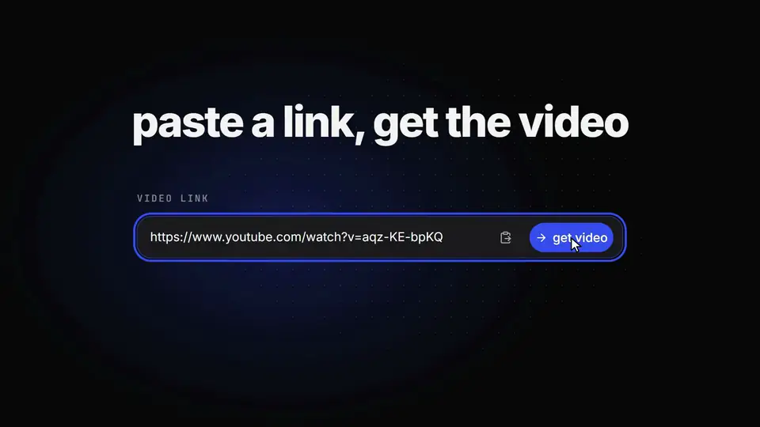
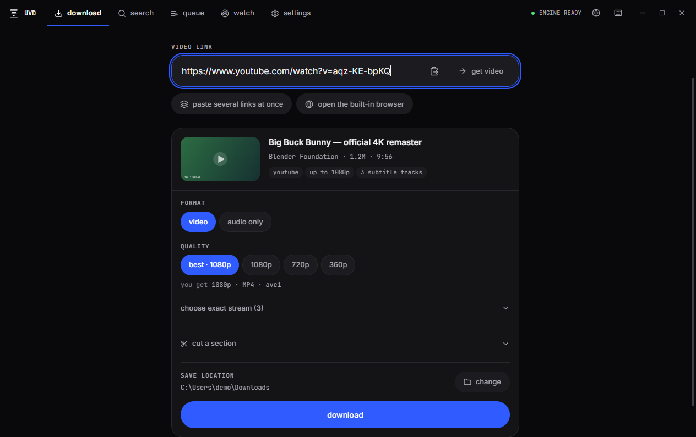
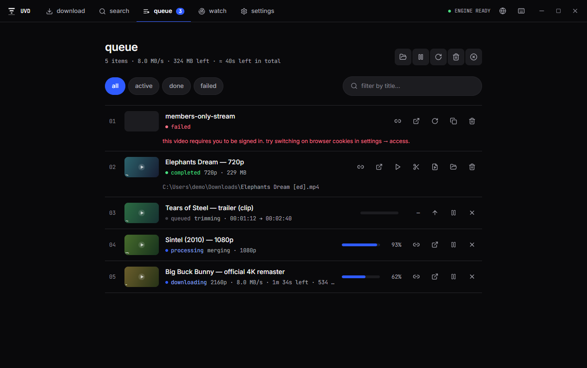
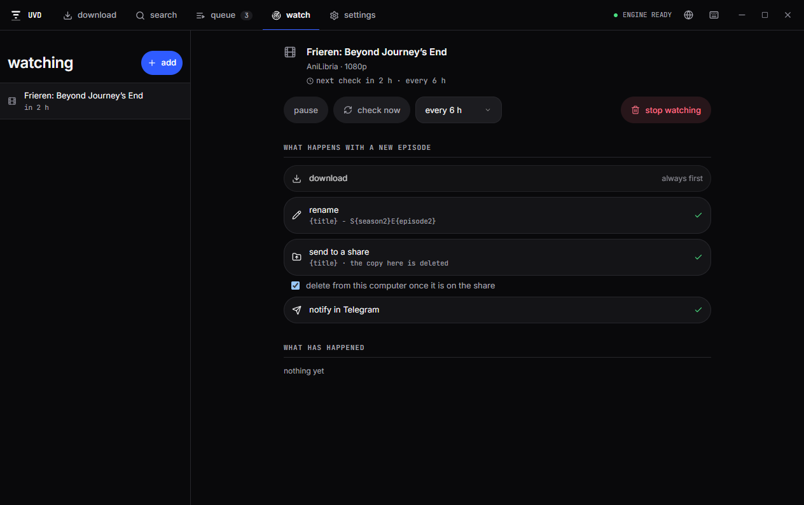
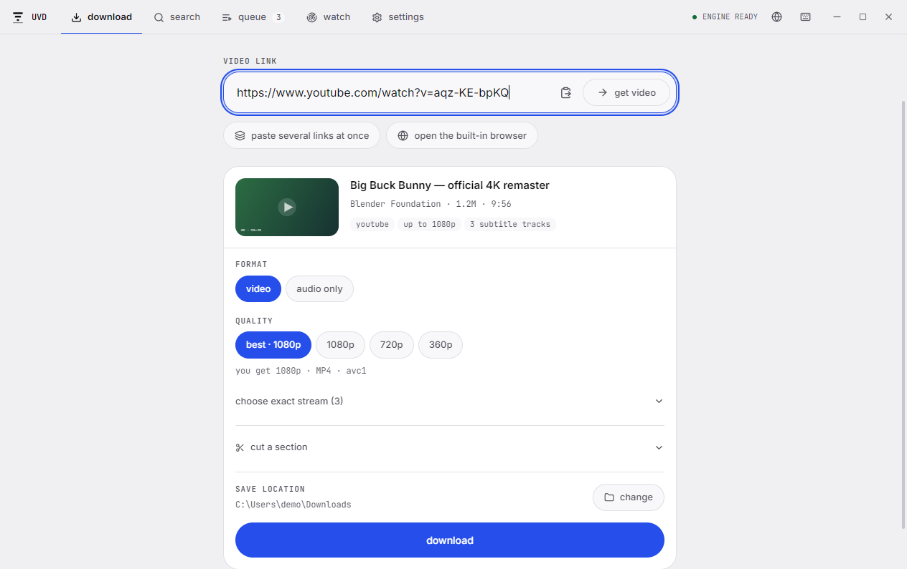

<div align="center">


# Universal Video Downloader

**Paste a link, get the video.**<br />
A free desktop app for Windows, macOS and Linux that downloads video from YouTube and 1800+ other sites,<br />
and finds the stream itself on pages nobody wrote an extractor for.

[](https://github.com/DenisHumen/Universal-Video-Downloader-/releases/latest)
[](https://github.com/DenisHumen/Universal-Video-Downloader-/releases/latest)
[](#linux)

[](https://github.com/DenisHumen/Universal-Video-Downloader-/releases/latest)
[](https://github.com/DenisHumen/Universal-Video-Downloader-/releases)
[](LICENSE)

**English** · [Русский](README.ru.md)

<br />

<a href="docs/assets/preview.mp4?raw=true"></a>
<br /><sub>▶ <a href="docs/assets/preview.mp4?raw=true">the same tour as an MP4, with sound</a> (6 MB)</sub>

</div>

<br />

## Why this one

- **It works on pages other downloaders give up on.** The yt-dlp engine handles 1800+ sites. When it doesn't know a site, the app reads the page, then plays it in a hidden browser and catches the stream as it loads, with the headers the server asks for.
- **It tells you what you'll get before you click.** The quality buttons come from what the video really has, and "best" says what it means: `2160p60 · HDR · MP4 · ≈ 1.2 GB`.
- **It can do the whole job for a series.** Watch a series and every new episode is downloaded, renamed, copied to a network share and announced in Telegram, without you opening the app.
- **No account, no ads, no telemetry.** Everything runs on your computer. English and Russian interface.

## Install

| Platform | Download | |
| --- | --- | --- |
| **Windows 10 / 11** | [`…-windows-x64-setup.exe`](https://github.com/DenisHumen/Universal-Video-Downloader-/releases/latest) | updates itself |
| **macOS**, Apple silicon | [`…-mac-arm64.dmg`](https://github.com/DenisHumen/Universal-Video-Downloader-/releases/latest) | see [the first-launch note](#macos-the-app-is-damaged-and-cant-be-opened) |
| **macOS**, Intel | [`…-mac-x64.dmg`](https://github.com/DenisHumen/Universal-Video-Downloader-/releases/latest) | |
| **Linux** | [apt or dnf](#linux) (recommended), or the [`.deb` / `.rpm` / `.AppImage`](https://github.com/DenisHumen/Universal-Video-Downloader-/releases/latest) | updates with the system |

On first launch the app downloads the yt-dlp engine (about 30 MB) and keeps it up to date; ffmpeg is built in. Then paste a link, pick the quality and press **download**. Files go to your *Downloads* folder.

### Linux

Ubuntu, Debian, Mint:

```bash
curl -fsSL https://denishumen.github.io/Universal-Video-Downloader-/uvd.gpg | sudo tee /usr/share/keyrings/uvd.gpg > /dev/null
echo "deb [arch=amd64 signed-by=/usr/share/keyrings/uvd.gpg] https://github.com/DenisHumen/Universal-Video-Downloader-/releases/latest/download/ ./" | sudo tee /etc/apt/sources.list.d/universal-video-downloader.list
sudo apt update && sudo apt install universal-video-downloader
```

Fedora, RHEL, openSUSE (on openSUSE the file goes to `/etc/zypp/repos.d/`):

```bash
sudo curl -fsSL -o /etc/yum.repos.d/universal-video-downloader.repo https://denishumen.github.io/Universal-Video-Downloader-/universal-video-downloader.repo
sudo dnf install universal-video-downloader
```

Both repositories are signed, and updates arrive with the rest of the system (`sudo apt upgrade`, `sudo dnf upgrade`).

### macOS: “the app is damaged and can’t be opened”

**It isn’t.** The builds are not signed with a paid Apple certificate, and macOS shows that sentence for any unsigned app it has quarantined. Copy the app into **Applications** and run this once:

```bash
xattr -dr com.apple.quarantine "/Applications/Universal Video Downloader.app"
```

The same command is printed in the install window. Unsigned apps can't replace themselves, so on a Mac the app offers you the new version's download page instead of updating in place.

## Download from the terminal

```bash
uvd https://www.youtube.com/watch?v=jNQXAC9IVRw
```

`uvd` takes the best quality the video has and saves it to your *Downloads* folder (or the folder set in the app), using the same engine, ffmpeg, cookies and proxy as the app. `uvd -q 720 <link>` takes at most 720p (`best`, `2160`, `1440`, `1080`, `720`, `480` or `360`; a video without that height gives the best it has), `uvd -a <link>` keeps the audio only, `-o <folder>` saves somewhere else, and several links download one after another. `uvd --help` lists it all. If a link isn't recognised, `uvd` says so and suggests opening the app, which has more ways to find the stream; it then exits with code 2, so scripts can tell.

- **Linux, apt / dnf / `.deb` / `.rpm` / AUR:** `uvd` is installed with the app.
- **Linux, AppImage:** open *Settings → system → terminal command* and press *install*. It puts a small `uvd` script in `~/.local/bin` that starts the AppImage, and keeps it pointing at the AppImage after updates. Move to the `.deb`, `.rpm` or AUR package later and the app deletes that script at its next launch, so it never hides the package's own `uvd`. Or run the AppImage with `--cli` yourself, e.g. `alias uvd='~/Applications/Universal-Video-Downloader.AppImage --cli'`.
- **macOS:** open *Settings → system → terminal command* and press *install*; macOS asks for your password once to link it into `/usr/local/bin`. Move the app to *Applications* first. Or make the link yourself:

  ```bash
  sudo mkdir -p /usr/local/bin && sudo ln -sf "/Applications/Universal Video Downloader.app/Contents/Resources/bin/uvd" /usr/local/bin/uvd
  ```

## What it can do

| Feature | What you get |
| --- | --- |
| **Almost any page** | yt-dlp first; then the page's own player data; then a hidden browser that catches the stream as it loads. A link from the address bar is enough. |
| **Honest quality** | Only the qualities the video really has, and the size before you download. |
| **One progress bar** | Download and the work after it (merging, converting, cutting) in one bar, with the step named. Pause, resume, retry, cancel. |
| **Cut and convert** | Download only the part you need, re-cut finished files, convert to MP4 / MKV / WebM / MOV / GIF or extract MP3 / M4A / FLAC / OPUS. |
| **Search by title** | YouTube, SoundCloud, Dailymotion, Bilibili, Niconico, PornHub and the YummyAnime catalogue, one service or all at once. |
| **Built-in browser** | For the stubborn page: open it, press play, and every stream it loads appears in a side panel, one click from the queue. |
| **Series and playlists** | Voiceovers, seasons and episodes on HDrezka and YummyAnime; playlists and channels as a pickable list; a whole list of links at once. |
| **Watch a series** | New episodes downloaded, renamed, sent to an SMB share and announced in Telegram, on a schedule. |
| **Sign-in videos** | Age-gated and members-only videos with cookies from your browser or a `cookies.txt`. |
| **Extras** | Subtitles, thumbnails and chapters embedded, SponsorBlock, per-site folders, filename template, speed limit, proxy, two themes. |

## Screenshots

<table>
  <tr>
    <td width="50%"><p align="center"><b>Detected</b> · the quality you will actually get</p></td>
    <td width="50%"><p align="center"><b>Queue</b> · one bar for download and post-processing</p></td>
  </tr>
  <tr>
    <td><p align="center"><b>Watch</b> · every new episode, handled</p></td>
    <td><p align="center"><b>Day theme</b> · designed on its own, not inverted</p></td>
  </tr>
</table>

## A site doesn't work?

1. **Switch on cookies.** *Settings → access & cookies*, then pick the browser you're signed in with. Age gates, login walls and "members only" go away. Close that browser while downloading; it locks its cookie database.
2. **Use the built-in browser.** Open the page there and press play; every stream it requests appears in the side panel. A consent banner you dismiss or a login you complete is remembered.
3. **Send a report.** When a link fails, the app offers to send the developer the link, the error and the engine's output. Nothing is sent unless you click, and paths, passwords and tokens are removed first.
4. **Or [open an issue](https://github.com/DenisHumen/Universal-Video-Downloader-/issues/new)** with the link and the *engine output* from the queue row.

## More detail

<details>
<summary><b>How detection works</b></summary>

<br />

The app tries three strategies, cheapest first, and stops at the first that works:

1. **The engine.** yt-dlp knows 1800+ sites: YouTube (and Shorts), TikTok, Instagram, X/Twitter, Reddit, Twitch, VK, Vimeo, SoundCloud, Bilibili and more. Share links are cleaned first, so a `youtu.be/…?si=…` and a `/shorts/…` link queue the same video once.
2. **The page itself.** JSON-LD `VideoObject`, OpenGraph `og:video`, `<video>` tags, JW Player / Video.js / Plyr configs, and one level of player iframes.
3. **A hidden browser.** The page opens in an invisible Chromium window, the player is started, and the manifest is captured from the network with the `Referer`, `Origin` and `Cookie` headers the server wants, which the engine then reuses.

Candidates are ranked (HLS ≫ DASH ≫ MP4 ≫ audio; trailers, ads and single segments are pushed down) by response type as well as by file name, which is what makes extensionless manifests work. Stream links expire, so the queue keeps the *page* address and detects again on every start and retry. The hidden browser can be switched off in *Settings → detection*.

</details>

<details>
<summary><b>Watching a series</b></summary>

<br />

Paste a link to a series page, choose the translation (dubs carry different episode counts, so this decides what counts as new) and how often to check. Every new episode runs the watch's steps:

| Step | What it does |
| --- | --- |
| **download** | Always first, through the normal queue: pause, retry and history work as usual. |
| **rename** | A template with `{title}` `{season}` `{episode}` `{season2}` `{episode2}` `{quality}` `{year}`, plus find/replace rules for the title. |
| **send to a share** | Uploads to an SMB share and creates missing folders; can delete the local copy afterwards. |
| **notify in Telegram** | A message from your own bot when an episode arrives, or fails. |

Checks run on a schedule with back-off on failures (15 minutes at the shortest); **check now** runs one at once. *Settings → watching* keeps schedules running from the tray when the window is closed and can start the app with the system. The SMB password and the Telegram token are encrypted by the operating system's key store. Design notes: [`docs/automation.md`](docs/automation.md).

</details>

<details>
<summary><b>Settings</b></summary>

<br />

| Section | What's there |
| --- | --- |
| **appearance** | Theme (night / day), language (follows the system) |
| **downloads** | Folder, per-site subfolders, default mode and quality, audio format, parallel downloads, resume on launch, speed limit, playlist size |
| **post-processing** | Embed thumbnail / metadata / chapters / subtitles, `.srt` files, subtitle languages, SponsorBlock, prefer H.264 + AAC, filename template |
| **detection** | The hidden-browser pass for unknown sites |
| **watching** | Background watching, start with the system, SMB shares, Telegram, detailed log |
| **access & cookies** | Cookies from Chrome, Firefox, Edge, Safari, Brave, Chromium, Opera, Vivaldi, or a `cookies.txt` |
| **network** | A proxy for the engine and for the app's own requests |
| **system** | Notifications, clipboard watcher, tray icon |
| **updates** | Automatic updates |

Settings, history and watches live in the per-user application data folder; the log (`uvd.log`) sits beside them, with secrets and signed links redacted before anything is written.

</details>

<details>
<summary><b>For developers</b></summary>

<br />

Electron 33, React 18, TypeScript, Tailwind and Zustand around yt-dlp and ffmpeg. Commands, releases, the design system and the project layout are in [`docs/DEVELOPMENT.md`](docs/DEVELOPMENT.md). Pull requests are welcome; site requests too, here or on [Telegram](https://t.me/DenisHumen).

</details>

## Legal

For downloading content you have the right to access. Respect the terms and copyright of the sites you use it with.

[MIT](LICENSE) © Denis Humen
