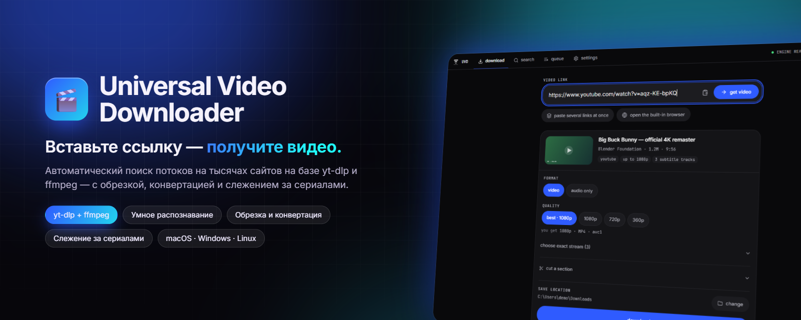

<div align="center">



# Universal Video Downloader

**Вставьте ссылку — получите видео. С тысяч сайтов, включая те, под которые никто не писал код.**

[](https://github.com/DenisHumen/Universal-Video-Downloader-/releases/latest)
[](https://github.com/DenisHumen/Universal-Video-Downloader-/actions/workflows/ci.yml)
[](#-быстрый-старт)
[](https://www.electronjs.org/)
[](https://www.typescriptlang.org/)
[](LICENSE)
[](https://github.com/DenisHumen/Universal-Video-Downloader-/commits/main)

[English](README.md) · **Русский**

[**⬇ Скачать**](https://github.com/DenisHumen/Universal-Video-Downloader-/releases/latest) &nbsp;·&nbsp; [Возможности](#-возможности) &nbsp;·&nbsp; [Скриншоты](#-скриншоты) &nbsp;·&nbsp; [Быстрый старт](#-быстрый-старт) &nbsp;·&nbsp; [Сайт не работает?](#-сайт-не-работает)

</div>

---

Universal Video Downloader — бесплатное десктопное приложение для macOS, Windows и Linux, которое находит видеопоток почти на любой веб-странице и скачивает его. Под капотом — [yt-dlp](https://github.com/yt-dlp/yt-dlp) и ffmpeg, а поверх них — автоматический поиск потоков на сайтах, которых yt-dlp не знает, и интерфейс, который честно говорит, что происходит: какое качество вы получите на самом деле, сколько весит файл и какой шаг выполняется сейчас. Интерфейс на русском и английском, без аккаунта и без телеметрии.

<div align="center">
  
</div>

## ✨ Возможности

| | |
|---|---|
| 🔎 **Универсальное распознавание** | Сначала 1800+ сайтов, которые знает yt-dlp, затем статический разбор страницы, затем скрытый проход Chromium, который перехватывает манифест прямо из сетевых запросов вместе с заголовками, которых требует CDN. |
| 🎯 **Честное качество** | Кнопки качества строятся из реально доступных разрешений, а «лучшее» сразу говорит, во что оно превратилось: `2160p60 · HDR · MP4 · avc1 · ≈ 1.2 GB`. |
| 📊 **Честный прогресс** | Одна полоса на скачивание (0–90 %) и постобработку (последние 10 %, с названием текущего шага). Скорость, ETA по каждой строке и по всей очереди, пауза / продолжение / повтор / отмена. |
| ✂️ **Обрезка и конвертация** | Вырежьте фрагмент *до* скачивания (загрузится только он), обрежьте уже скачанный файл, конвертируйте в MP4 / MKV / WebM / MOV / GIF или извлеките звук в MP3 / M4A / OPUS / FLAC / WAV / AAC. |
| 🔍 **Поиск по названию** | YouTube, SoundCloud, Dailymotion, Bilibili, Niconico, PornHub и каталог YummyAnime — в одном сервисе или во всех сразу. |
| 🌐 **Встроенный браузер** | Если автоматика ничего не нашла: откройте страницу, запустите видео — каждый медиазапрос появится в боковой панели. **Режим выбора** забирает источник плеера по клику. |
| 🎞 **Стриминговые сайты** | Собственные резолверы для HDrezka, YummyAnime (плеер Kodik) и CumGloryHole: озвучки, сезоны, серии и качество, с множественным выбором. |
| 👁 **Слежение за сериалами** | Приложение следит за сериалом и само обрабатывает каждую новую серию: скачать → переименовать → загрузить на SMB-шару → сообщить в Telegram. |
| 📚 **Плейлисты и пакеты** | Плейлисты, каналы и подборки раскрываются в список с выбором; можно вставить сразу целый список ссылок. |
| 🧩 **Постобработка** | Встраивание обложки, метаданных, глав и субтитров, отдельные `.srt`, SponsorBlock, подпапки по сайтам, шаблон имени файла, ограничение скорости. |
| 🍪 **Закрытые сайты** | Видео с проверкой возраста, только для вошедших или для подписчиков — через cookies из вашего браузера или файл `cookies.txt`. |
| 🌍 **Русский и English** | Полностью локализованный интерфейс, включая меню, трей и уведомления; ошибки движка тоже переводятся, а оригинал сохраняется для баг-репорта. |
| 🔄 **Самообновление** | Приложение обновляется из GitHub Releases; движок yt-dlp обновляется раз в сутки и никогда — во время скачивания. |
| 🔒 **Приватно и локально** | Всё работает на вашем компьютере. Никаких аккаунтов и телеметрии. |

## 📸 Скриншоты

<table>
  <tr>
    <td width="50%"><p align="center"><b>Главная</b> — вставьте ссылку и выберите, что получить</p></td>
    <td width="50%"><p align="center"><b>Очередь</b> — одна полоса на скачивание и постобработку</p></td>
  </tr>
  <tr>
    <td><p align="center"><b>Поиск</b> — по названию, в разных сервисах</p></td>
    <td><p align="center"><b>Настройки</b></p></td>
  </tr>
  <tr>
    <td colspan="2"><p align="center"><b>Дневная тема</b> — спроектирована отдельно, а не инвертирована из ночной</p></td>
  </tr>
</table>

## 🚀 Быстрый старт

### Скачать

| Платформа | Загрузка | Файл |
| --- | --- | --- |
| **Windows 10/11** | [**Последний релиз ↓**](https://github.com/DenisHumen/Universal-Video-Downloader-/releases/latest) | `…-windows-x64-setup.exe` |
| **macOS** (Apple Silicon) | [**Последний релиз ↓**](https://github.com/DenisHumen/Universal-Video-Downloader-/releases/latest) | `…-mac-arm64.dmg` |
| **macOS** (Intel) | [**Последний релиз ↓**](https://github.com/DenisHumen/Universal-Video-Downloader-/releases/latest) | `…-mac-x64.dmg` |
| **Ubuntu / Debian** | [**Последний релиз ↓**](https://github.com/DenisHumen/Universal-Video-Downloader-/releases/latest) | `.deb` или `.AppImage` |
| **Fedora / RHEL** | [**Последний релиз ↓**](https://github.com/DenisHumen/Universal-Video-Downloader-/releases/latest) | `.rpm` или `.AppImage` |

1. Установите и запустите приложение. При первом запуске оно само скачает движок yt-dlp (~30 МБ) и дальше будет держать его в актуальном состоянии. ffmpeg уже встроен.
2. Вставьте ссылку на вкладке **скачать** (или перетащите её в любое место окна).
3. Выберите качество и формат — приложение покажет, что вы получите на самом деле, — и нажмите «скачать». По умолчанию файлы сохраняются в системную папку *Загрузки*.

### macOS: «Программа повреждена, и её не удаётся открыть»

**Она не повреждена.** Сборки не подписаны — за ними нет сертификата Apple Developer за €99 в год, — а свежие версии macOS выдают эту фразу для *любого* неподписанного приложения в карантине. Звучит как битая загрузка, поэтому люди скачивают файл заново и снова видят то же сообщение.

Скопируйте приложение в **Программы** и один раз выполните:

```bash
xattr -dr com.apple.quarantine "/Applications/Universal Video Downloader.app"
```

Эта команда напечатана прямо в окне установщика, так что возвращаться сюда за ней не придётся. (Или: правый клик по приложению в «Программах» → **Открыть** → **Открыть**.) Из-за отсутствия подписи сборки для macOS не могут обновляться сами — приложение честно предлагает страницу загрузки вместо того, чтобы делать вид, что перезапустится в новую версию. Так же обновляются установки из `.deb` / `.rpm`.

## 🧭 Использование

### Универсальное распознавание — без доработки под каждый сайт

Большинство загрузчиков работают только с сайтами, под которые кто-то написал код. Этот пробует три стратегии по порядку, от самой дешёвой, и останавливается на первой сработавшей:

1. **Движок** — yt-dlp сам знает 1800+ сайтов, в том числе YouTube (и Shorts), TikTok, Instagram Reels, X/Twitter, Reddit, Twitch, VK, Vimeo, Dailymotion, SoundCloud, Bilibili и Niconico. Ссылки «поделиться» сначала приводятся к каноническому виду, поэтому `youtu.be/…?si=…`, `/shorts/…` и ссылка TikTok с шестью аналитическими параметрами ведут к одному и тому же видео — и попадают в очередь один раз.
2. **Статический разбор** — если движок сайт не знает, приложение читает страницу само: JSON-LD `VideoObject`, OpenGraph `og:video`, теги `<video>`/`<source>`, конфигурации JW Player / Video.js / Plyr и один уровень iframe с плеерами.
3. **Проход headless-браузером** — всё ещё пусто? Приложение открывает страницу в скрытом окне Chromium, запускает плеер (заглядывая в shadow DOM и ленивые `data-*`-источники — именно там прячутся современные плееры) и перехватывает запрос манифеста *прямо из сети* — вместе с точными заголовками `Referer` / `Origin` / `Cookie`, которых требует CDN. Эти заголовки передаются движку, поэтому поток скачивается так же, как его воспроизвёл бы браузер.

Кандидаты ранжируются (HLS-манифест ≫ DASH ≫ прогрессивный MP4 ≫ аудио; трейлеры, спрайты превью, рекламные медиа и отдельные HLS-сегменты понижаются) и распознаются **по типу ответа, а не только по имени файла** — благодаря этому работают манифесты CDN без расширения. Найдя манифест, приложение ещё немного слушает сеть, а не хватает первый попавшийся: и мастер-плейлист, и вариант 480p, который выбрал плеер, — оба манифесты, но 4K есть только в одном из них.

Ссылки на потоки со временем истекают, поэтому очередь хранит адрес *страницы* и заново запускает распознавание при каждом старте и повторе. Проход headless-браузером можно отключить в **Настройки → определение**.

### Приложение говорит, что значит «лучшее»

Пресет — это обещание конкретного числа, и «лучшее» раньше держало его в секрете. Ряд качества строится из разрешений, которые у видео действительно есть, — никакой фантомной кнопки 360p у ролика 720/480/240, — а автоматический выбор показывает, во что он превратился, вместе с контейнером и размером файла:

> **качество** — `best · 4K` `1080p` `720p` `360p`
> *вы получите* `2160p60 · HDR · MP4 · avc1 · ≈ 1.2 GB`

Очередь продолжает это показывать, так что строка, качающая «лучшее», всё равно скажет, оказалось это 1080p или 360p.

### Честная полоса прогресса

Скачать байты — это ещё не вся работа. Обрезанная загрузка перекодирует фрагмент, загрузка видео+аудио склеивает два потока, аудиозагрузка извлекает и конвертирует звук — и на длинном видео эта половина может занять столько же, сколько первая. Поэтому полоса разделена: скачиванию принадлежат 0–90 %, постобработке — последняя десятая часть, и она называет текущий шаг.

Обрезанные и live-загрузки движок передаёт ffmpeg, а тот не выводит привычных строк прогресса yt-dlp — поэтому приложение читает вывод самого ffmpeg, и «вырезать фрагмент и скачать» показывает движущуюся полосу, а не ноль, который потом резко становится «готово». Если сайт вообще не сообщает размер, полоса показывает это анимацией, а не уверенными 0 %, которые никогда не меняются.

Скорость, ETA по каждой строке и по всей очереди, пауза / продолжение / повтор / отмена на любом этапе, автоматические повторы при временных сетевых сбоях и сырой вывод движка в один клик, если что-то пошло не так. Пока идут загрузки, приложение не даёт компьютеру уснуть (экран при этом может погаснуть), а прерванные загрузки подхватываются при следующем запуске.

### Обрезка и конвертация, не выходя из приложения

- **Обрезка до скачивания.** Задайте начало и конец на таймлайне, и движок загрузит *только этот фрагмент* — 30 секунд из двухчасового стрима стоят 30 секунд трафика, а не весь файл.
- **Обрезка того, что уже скачано.** Любую готовую загрузку можно обрезать заново.
- **Точно или быстро — на выбор.** По умолчанию срез точный до кадра — с перекодированием, так что «убрать интро» действительно убирает интро. Копирование потока — в один клик, когда важнее скорость: почти мгновенно, но срез попадает на ближайший ключевой кадр. Выбор работает и для обрезанной *загрузки*, и для файла на диске, и на длинном фрагменте это разница между секундами и минутами.
- **Конвертация** в MP4, MKV, WebM, MOV или анимированный GIF, извлечение звука в MP3, M4A, OPUS, FLAC, WAV или AAC и уменьшение разрешения по ходу. Конвертации выполняются в той же очереди, что и загрузки.

### Поиск по названию

Введите название вместо ссылки. Ищите **во всех сервисах сразу** или в одном: YouTube, SoundCloud, Dailymotion, Bilibili, Niconico, PornHub и каталог YummyAnime. В результатах — превью, длительность и значок лучшего доступного качества.

### Встроенный браузер — когда ничего не нашлось

Автоматическое распознавание хорошее, но не всеведущее. Если оно ничего не нашло, приложение открывает настоящий Chromium: перейдите к видео, запустите его — и каждый медиазапрос страницы появится в боковой панели, в одном клике от очереди. **Режим выбора** подсвечивает элементы под курсором — кликните по плееру, и приложение возьмёт источник этого элемента.

Браузер делит сессию со скрытым детектором, поэтому закрытый баннер согласия или выполненный здесь вход продолжают действовать, когда элемент очереди позже распознаётся заново.

### Собственные резолверы — для сайтов, которым они нужны

Некоторые плееры прячут поток за подписанным AJAX-запросом, до которого не дотянется ни один универсальный парсер. Для таких сайтов есть небольшой отдельный модуль в `src/main/resolvers/sites/` — сейчас это **HDrezka** (и её зеркала), **YummyAnime** (через плеер Kodik) и **CumGloryHole**.

На стриминговых сайтах приложение читает доступные **озвучки**, **сезоны**, **серии** и **качество**, позволяет выбрать несколько серий и ставит каждую в очередь как `Title - S01E02`. Премиум-озвучки помечаются и недоступны для скачивания.

### Слежение за сериалом — новые серии обрабатываются сами

Вкладка **слежение** присматривает за страницами сериалов. Вставьте ссылку на сериал (страницу со списком серий), выберите озвучку — у разных озвучек разное число серий, так что именно она определяет, что считать новым, — и частоту проверок. Каждая серия, которая появится позже, проходит через конвейер этого слежения:

| Шаг | Что делает |
| --- | --- |
| **скачать** | Всегда первый. Работает через обычную очередь загрузок, так что пауза, отмена, повтор и история работают как обычно. |
| **переименовать** | Шаблон имени файла с `{title}` `{season}` `{episode}` `{season2}` `{episode2}` `{quality}` `{year}` и правила «найти/заменить» для названия (сайт отвечает на своём языке — так файл получает то имя, которое нужно вам). |
| **отправить на шару** | Загружает файл на SMB-шару (сервер, шара, пользователь, пароль) и создаёт недостающие папки; в удалённом пути работают те же токены. Может удалить локальную копию после загрузки. |
| **уведомить в Telegram** | Сообщение от вашего бота, когда серия пришла и когда что-то не удалось. |

- Слежение работает с сериалами из встроенных стриминговых резолверов и проверено на **YummyAnime**. Можно следить и за анонсированным, но ещё не вышедшим тайтлом: дата выхода перепроверяется раз в сутки, а когда появятся серии, выбирается самая полная озвучка.
- Проверки идут по расписанию со случайным разбросом и увеличением интервала при сбоях (минимальный интервал — 15 минут); кнопка **проверить сейчас** запускает проверку немедленно.
- В **Настройки → слежение** включаются *продолжать следить в фоне* (закрытие окна не останавливает расписание — приложение остаётся в трее) и *запускаться вместе с системой* (только в собранных версиях).
- Пароль SMB и токен Telegram-бота шифруются хранилищем ключей операционной системы и никогда не попадают в файл настроек.

Проектные заметки по этой функции — в [`docs/automation.md`](docs/automation.md) (на английском).

### Всё остальное

- **Плейлисты и каналы** — ссылка на плейлист, канал или подборку раскрывается в список с чекбоксами, «выбрать всё», выбором диапазона и массовой загрузкой. Ссылка на одно видео, которое просто *находится внутри* плейлиста, по-прежнему скачивает только его.
- **Пакет ссылок** — вставьте целый список URL и поставьте их в очередь одним действием.
- **Постобработка** — встраивание обложки, метаданных, глав и субтитров; субтитры отдельными `.srt`; вырезание сегментов SponsorBlock; подпапки по сайтам; ограничение скорости.
- **Закрытые сайты** — видео с проверкой возраста, только для вошедших и только для подписчиков работают через cookies из вашего браузера или из файла `cookies.txt`: **Настройки → доступ и cookies**. Если сбой похож на закрытый доступ, приложение так и скажет и предложит эту настройку.
- **Ошибки на вашем языке** — движок говорит только по-английски; приложение переводит его сообщения и сохраняет оригинал для баг-репорта.
- **Темы и язык** — две продуманные темы, ночная и дневная, и полностью **русский / английский** интерфейс — включая меню, трей и уведомления, — который по умолчанию следует языку системы.
- **Удобства** — уведомления на рабочем столе, прогресс на панели задач / в доке, необязательный значок в трее, чтобы загрузки продолжались при закрытом окне, необязательное слежение за буфером обмена, drag-and-drop, вставка откуда угодно, нативное меню и горячие клавиши (⌘/Ctrl+1…5 — вкладки, ⌘/Ctrl+, — настройки, ⌘/Ctrl+/ — список всех сочетаний).
- **Самообновление** — при запуске проверяет новые релизы и устанавливает их. Движок yt-dlp тоже обновляется сам — раз в сутки и никогда во время загрузки.
- **Приватно и локально** — всё работает на вашем компьютере. Никаких аккаунтов и телеметрии.

## ⚙️ Настройка

Всё настраивается в самом приложении (вкладка **настройки** или ⌘/Ctrl+,). Разделы и их содержимое:

| Раздел | Настройки |
| --- | --- |
| **внешний вид** | Тема (ночная / дневная), язык (по умолчанию — как в системе) |
| **загрузки** | Папка загрузок (по умолчанию — системные *Загрузки*), подпапки по сайтам, режим и качество по умолчанию, аудиоформат, число параллельных загрузок (по умолчанию 3), продолжение после перезапуска, ограничение скорости (например, `2M`, `500K`), сколько элементов плейлиста/канала показывать (по умолчанию 500) |
| **обработка** | Встраивание обложки / метаданных / глав / субтитров, запись `.srt`, языки субтитров (по умолчанию `en,ru`), SponsorBlock, предпочитать H.264 + AAC, когда сайт даёт выбор, «безопасные» имена файлов, шаблон имени (по умолчанию `%(title)s [%(id)s].%(ext)s`) |
| **определение** | Универсальное распознавание — проход скрытым браузером для сайтов без резолвера (включено по умолчанию) |
| **слежение** | Продолжать следить в фоне, запускаться вместе с системой, SMB-шары, уведомления в Telegram, подробный журнал, кнопка «показать файл журнала» |
| **доступ и cookies** | Cookies из Chrome, Firefox, Edge, Safari, Brave, Chromium, Opera или Vivaldi либо из `cookies.txt` в формате Netscape (имеет приоритет) |
| **сеть** | Прокси (`http://host:port`) — используется и движком, *и* собственными запросами приложения (страницы, API сайтов, встроенный браузер, проверка обновлений) |
| **система** | Уведомления, слежение за буфером обмена, значок в трее |
| **обновления** | Автоматические обновления |
| **о программе** | Информация о приложении, ссылка на GitHub, сброс всех настроек |

Состояние хранится в папке пользовательских данных приложения: `settings.json`, история загрузок и `watches.json`. Лог (`uvd.log`, ротация по 2 МБ × 5 файлов) лежит в папке логов приложения; секреты и подписанные ссылки вырезаются до записи.

## 🤔 Сайт не работает?

Примерно в порядке того, как часто это помогает:

1. **Включите cookies.** *Настройки → доступ и cookies* → выберите браузер, в котором вы вошли в аккаунт. Проверки возраста, требования входа и «только для подписчиков» исчезают. Закройте этот браузер на время загрузки — он блокирует собственную базу cookies.
2. **Воспользуйтесь встроенным браузером.** *Открыть встроенный браузер*, перейти к видео, нажать play. Каждый поток, который запрашивает страница, появится в боковой панели, в одном клике от очереди, — а всё, что вы сделали по пути (баннер согласия, вход), запомнится для последующих повторных загрузок.
3. **Проверьте, что универсальное распознавание включено.** *Настройки → определение*. Без него приложение может скачивать только с сайтов, которые знает движок.
4. **Подождите минуту.** Незнакомый сайт обрабатывается до полуминуты: приложение загружает страницу в скрытом окне и ждёт, пока плеер запросит видео.
5. **Всё равно ничего?** [Создайте issue](https://github.com/DenisHumen/Universal-Video-Downloader-/issues/new) со ссылкой и содержимым панели *вывод движка* из строки очереди. Большинству сайтов код не нужен вовсе; те, которым нужен, получают небольшой модуль в `src/main/resolvers/sites/`.

## 🧱 Технологии и архитектура

| Слой | Выбор |
| --- | --- |
| Оболочка | Electron 33 |
| Сборка | electron-vite + electron-builder |
| UI | React 18 + TypeScript + Tailwind CSS |
| Анимация | Framer Motion |
| Состояние | Zustand |
| Тесты | Vitest |
| Движок | yt-dlp (управляется во время работы) + ffmpeg (встроен; релизные сборки фиксируют ffmpeg 9.0.2) |
| Загрузка на SMB | node-smb2 |
| Обновления | electron-updater (провайдер GitHub) |

### 🎨 Внешний вид

**UVD — Precision** — дизайн-система в духе швейцарского модернизма: строгая сетка, тонкие линии вместо теней, почти монохромные плоскости и ровно один насыщенный цвет. Глубина создаётся наложением плоских поверхностей, а не размытием или свечением. Навигация — текстовая полоса вкладок на единственной панели высотой 48px, никаких боковых меню. Шрифт интерфейса — Inter; все размеры, пути и идентификаторы набраны JetBrains Mono с табличными цифрами, так что данные с первого взгляда отличаются от подписей. Оба шрифта поставляются вместе с приложением, а не загружаются из сети, поэтому оно выглядит одинаково и офлайн. Одна кривая сглаживания — `cubic-bezier(0.2, 0, 0, 1)` — и три длительности покрывают все переходы, а в покое ничего не анимируется.

Две темы, один акцент, и светлая — не инвертированная копия тёмной: светлому интерфейсу нужен фон *темнее* плоскостей на нём, иначе каждый блок растворяется в странице.

Цвета текста — именованные токены, а не прозрачность поверх основного цвета: одна и та же прозрачность выглядит по-разному на каждой поверхности, и именно так палитра незаметно проваливается ниже AA. `npm run check:contrast` вытаскивает реальные значения из таблицы стилей и проверяет каждую пару «текст/плоскость» в обеих темах, роняя CI ниже WCAG AA (4.5:1).

Полная спецификация — в [`design-system/universal-video-downloader/MASTER.md`](design-system/universal-video-downloader/MASTER.md).

### 🛠 Разработка

Нужны Node.js (в CI используется Node 20) и npm.

```bash
npm install              # установить зависимости
npm run dev              # запустить приложение с горячей перезагрузкой
npm run typecheck        # проверка типов main + renderer
npm test                 # юнит-тесты
npm run check:contrast   # проверка WCAG AA для всех тем
npm run build            # собрать main, preload и renderer
```

Несколько полезных дополнений:

```bash
npm run preview          # только renderer, в браузере, с моком IPC
npm run shots            # пересоздать docs/screenshots (--theme=day|both для светлой темы)
npm run make:icons       # растеризовать логотип в иконки приложения, трея и DMG
npm run fetch:ffmpeg     # заменить бинарник ffmpeg-static на зафиксированный ffmpeg 9.0.2 (как в CI)
npm run check:ffmpeg     # проверить, что встроенный ffmpeg соответствует целевой архитектуре
```

`npm run preview` — способ работать над UI без запуска Electron: `src/renderer/src/lib/mockApi.ts` подменяет preload-мост, включая состояния, до которых настоящее приложение добирается редко (первая загрузка движка, баннер обновления, все состояния строки очереди).

Локальная сборка дистрибутивов:

```bash
npm run pack         # распакованное приложение в release/<version>/ (быстрая проверка упаковки)
npm run dist:mac     # .dmg + .zip
npm run dist:win     # .exe (NSIS)
npm run dist:linux   # .AppImage + .deb + .rpm
```

### 📦 Релизы

Пуш тега `v*` запускает [release workflow](.github/workflows/release.yml): он сначала проверяет, что тег совпадает с версией в `package.json`, затем собирает приложение на раннерах macOS (arm64 и x64), Windows и Linux и публикует артефакты в GitHub Releases — включая метаданные `latest*.yml`, на которых работает автообновление.

```bash
npm version patch        # поднять версию и создать тег
git push --follow-tags   # CI соберёт и опубликует релиз
```

## 📁 Структура проекта

```
src/
├── main/                      # главный процесс Electron
│   ├── index.ts               # окна, меню, трей, жизненный цикл
│   ├── ipc.ts                 # IPC-обработчики ↔ renderer
│   ├── automation-ipc.ts      # IPC для слежения, шар и Telegram
│   ├── resolvers/             # превращение ссылки в скачиваемый поток
│   │   ├── index.ts           # реестр + внутренние схемы uvd-*://
│   │   ├── http.ts            # общие помощники для запросов и разбора
│   │   ├── upcoming.ts        # анонсированные, но ещё не вышедшие тайтлы
│   │   ├── sites/             # по модулю на каждый сайт с ручным резолвером
│   │   └── universal/         # распознавание без привязки к сайту
│   │       ├── static.ts      #   HTML/JSON-LD/OpenGraph/конфиги плееров
│   │       ├── sniffer.ts     #   скрытый браузер + перехват сети
│   │       ├── candidates.ts  #   оценка и ранжирование медиа-URL
│   │       ├── capture.ts     #   общие webRequest-хуки со счётчиком ссылок
│   │       └── direct.ts      #   uvd-direct:// — поток, выбранный вручную
│   └── services/
│       ├── ytdlp.ts           # загрузка и обновление бинарника yt-dlp
│       ├── detector.ts        # каскад движок → разбор → браузер
│       ├── downloader.ts      # очередь: загрузки, обрезка и конвертация
│       ├── progress.ts        # одна полоса на скачивание + постобработку
│       ├── throttle.ts        # как часто работающей задаче можно отчитываться
│       ├── schedule.ts        # что очередь запускает следующим
│       ├── dedupe.ts          # защита от второй записи на тот же файл
│       ├── resume.ts          # какие загрузки подхватить после перезапуска
│       ├── ffmpeg.ts          # встроенный ffmpeg: обрезка, конвертация, анализ
│       ├── ffmpeg-output.ts   # чтение консольного вывода ffmpeg для прогресса
│       ├── browser.ts         # окно встроенного браузера
│       ├── search.ts          # поиск по названию в разных сервисах
│       ├── clipboard.ts       # необязательное слежение за буфером обмена
│       ├── awake.ts           # не даёт компьютеру уснуть во время загрузок
│       ├── proxy.ts           # применяет прокси к собственным запросам
│       ├── updater.ts         # автообновление (+ ручной вариант)
│       ├── locale.ts          # строки, которые рисует ОС, а не React
│       ├── log.ts             # лог с ротацией и вырезанием секретов
│       ├── secrets.ts         # хранение паролей и токенов, зашифрованных ОС
│       ├── options.ts         # флаги движка и классификация ошибок
│       ├── settings.ts        # сохранённые настройки пользователя
│       └── automation/        # слежение: проверка, расписание, конвейер, SMB, Telegram
├── preload/
│   ├── index.ts               # безопасный API через contextBridge
│   └── site.ts                # внедряется в страницы встроенного браузера
├── renderer/                  # интерфейс на React
│   └── src/
│       ├── components/        # верхняя панель, карточки, строки, баннеры…
│       ├── views/             # Home, Search, Downloads, Automation, Settings
│       ├── lib/               # выбор качества, ошибки, форматирование, анимации
│       ├── i18n/              # словари en + ru
│       └── store.ts           # Zustand-хранилище, связанное с событиями IPC
└── shared/                    # типы, имена IPC-каналов, канонизация URL, модель слежения
```

Прочие папки верхнего уровня: `scripts/` (ffmpeg, иконки, скриншоты, проверка контраста и упаковки), `design-system/` (визуальная спецификация), `docs/` (скриншоты и проектные заметки), `build/` и `resources/` (графика для упаковки и иконки).

### Как добавить сайт вручную

1. Создайте `src/main/resolvers/sites/<site>.ts`, экспортирующий `SiteResolver[]`.
2. Добавьте его в массив `resolvers` в `src/main/resolvers/index.ts`.

Резолвер возвращает настоящий URL потока и нужные ему заголовки — либо список элементов, либо полноценный выбор серий и качества. Всё, что дальше по цепочке (очередь, повторы, повторное распознавание), уже умеет работать со всеми тремя вариантами.

## 🤝 Участие в разработке

Приложение активно развивается. Баг-репорты, запросы сайтов и pull request'ы приветствуются — [создайте issue](https://github.com/DenisHumen/Universal-Video-Downloader-/issues) (для неработающего сайта приложите ссылку и *вывод движка*) или попросите добавить сервис в [Telegram](https://t.me/DenisHumen). Перед PR запустите `npm run typecheck`, `npm test` и `npm run check:contrast` — CI выполняет те же проверки.

## ⚖️ Правовая информация

Этот инструмент предназначен для скачивания контента, к которому у вас есть законный доступ. Соблюдайте условия использования и авторские права сайтов, с которыми вы его используете.

## 📄 Лицензия

[MIT](LICENSE) © Denis Humen
